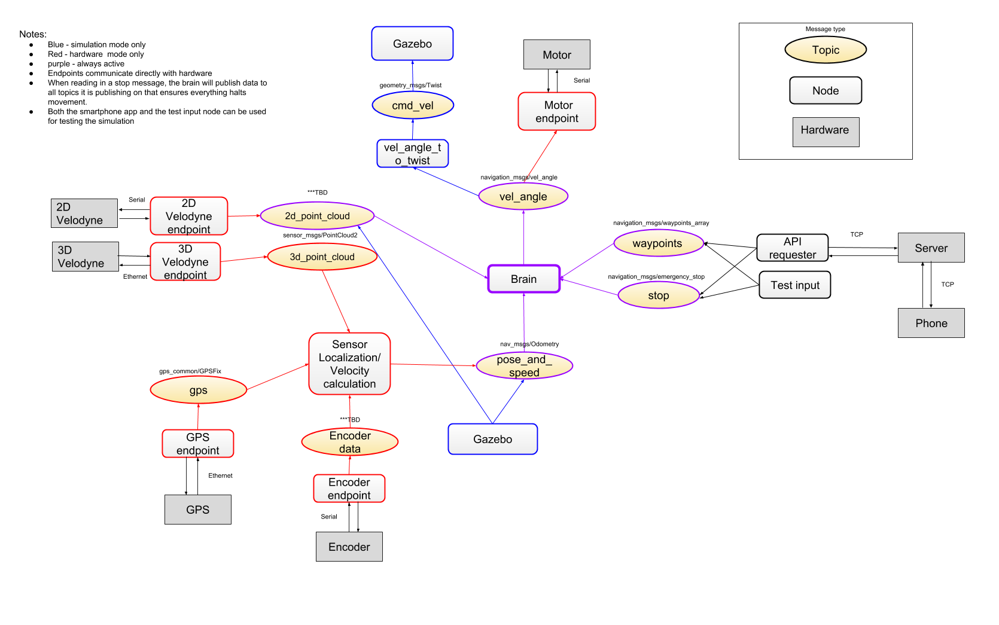

# Autonomous-Navigation
*Zack Allen Nicholas Weiland Jordan Domsky Alex Martin*

Autonomous golf cart planning and simulation built on ROS kinetic 

Cd into planning_navigation and then compile the workspace by running:

	catkin_make

Get ros to recognize the package

	source $(pwd)/devel/setup.bash

To make ros recognize the package every time you open a new terminal window, 
add the previous command to your bashrc file:

	echo source $(pwd)/devel/setup.bash >> ~/.bashrc

To get the necessary ros dependencies if you have problems running the launch files:
  
	rosdep install --from-paths src --ignore-src

Here is the ROS node architecture:

